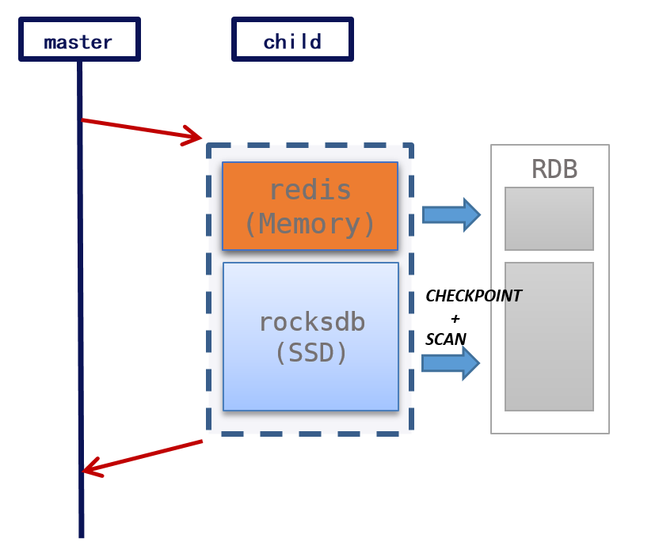

## Introduction

ROR is a more cost-effective alternative to redis, uses RocksDB as the storage engine and can save about 2/3 of the cost.

ROR extends SWAP feature based on redis codebase, it is compatible with almost all redis commands (including lua and multi/exec) and redis replication (RDB + RESP).

## Architecture

### SWAP

ROR stores hot and cold data in redis and RocksDB respectively, and exchanges hot and cold data automatically:

- SWAP IN: If key is cold, ROR reads cold key from RocksDB to redis, and then processes the command.
- SWAP OUT: If maxmemory is reached, ROR picks least frequently used key(LFU), and then writes the key to RocksDB.


### Replication

Redis can be the slave of ror by directly executing the slaveof command. ROR replication process is almost the same with redis, the only difference lies in RDB generation for cold data: RocksDB CHECKPOINT is obtained first, and then the cold data is scanned and converted into RDB format.



## Getting Started with ROR

#### 1. Running with Docker

1. Compilation Process
    ```sh
    git clone https://github.com/ctripcorp/Redis-On-Rocks.git
    cd Redis-On-Rocks
    # use Dockerfile in current dir to build images, image name is ror
    docker build -t ror .
    # run ror docker image, and interact with docker by bash
    docker run -it ror /bin/bash
    ```

### 2. Compilation from Source

1. Supported Platforms
    * Linux - CentOS
    * Linux - Ubuntu
    * macOS(Darwin)

2. Required Library Software
    * snappy-devel
    * zlib-devel
    * gflags-devel
    * libstdc++

3. Compilation Process
    * 3.1 Install Library
    ```bash
    # GCC versions among (gcc-9, gcc-10, gcc-11, gcc-13) are well supported.
    # WARNING: gcc-12 is not supported, for bug: https://gcc.gnu.org/bugzilla/show_bug.cgi?id=115824

    # for Ubuntu/Debian
    sudo apt update
    sudo apt install -y build-essential libsnappy-dev libsnappy1v5 pkg-config zlib1g zlib1g-dev

    # for CentOS/RHEL
    sudo yum install -y zlib-devel-1.2.11 snappy-devel-1.1.8 jemalloc-5.2.1 procps-ng-3.3.17

    # for Mac
    # Ensure Homebrew is installed
    # /bin/bash -c "$(curl -fsSL https://raw.githubusercontent.com/Homebrew/install/HEAD/install.sh)"
    # Install required packages
    brew install libsnappy pkg-config zlib
    ```
    * 3.2 Get the source code
    ```bash
    git clone https://github.com/ctripcorp/Redis-On-Rocks/
    ```
    * 3.3 Switch to the latest release version
    ```bash
    git tag          # Check the latest release tag (e.g., ror-1.2.4)
    git checkout TAG # Switch to the latest version (e.g., git checkout ror-1.2.4)
    ```
    * 3.4 Execute compilation
    ```bash
    cd Redis-On-Rocks
    git submodule update --init --recursive
    make
    ```

## Migration
### From redis
#### RDB
1. ROR is compatible with redis rdb, so it can directly read redis rdb file. In ror disk swap node, when migrate data from ror to redis, just put rdb file in ror data dir, and start ror node. All data in rdb file, would be trear as cold data. When cold data is fetched, it would be loaded into memory as hot data.

### To Redis
1. In ror disk swap node, when migrate data from ror to redis, just put rdb file in ror data dir, and start ror node. All data in rdb file, would be trear as cold data. When cold data is fetched, it would be loaded into memory as hot data.

## Benchmark ROR Performance

### Performance
1. Two scenarios of performance testing
    1. 100thd: 100 concurrency, no speed limit
    2. 10Kqps: 1000 concurrency, speed limit to 10000 QPS

2. Public cloud performance
   1. Cold refers to conf mammemory's size. Hot refers to data size exceeds maxmemory conf size. 
   2. SIN-AWS & FRA-AWS (r6gd.4xlarge)
    <table>
        <tr>
            <th style="font-weight: normal" colspan="3">Scenario\Program</th>
            <th style="font-weight: normal">xredis</th>
            <th style="font-weight: normal">ror</th>
        </tr>
        <tr>
            <th style="font-weight: normal" rowspan="6">Hot</th>
            <th style="font-weight: normal" rowspan="2">Get</th>
            <th style="font-weight: normal">100thd</th>
            <th style="font-weight: normal">QPS=100344<br/>Latency(mean,p99): 952 1804(us)</th>
            <th style="font-weight: normal">QPS=85566<br/>Latency(mean,p99):1131 2135(us)</th>
        </tr>
        <tr>
            <th style="font-weight: normal">10Kqps</th>
            <th style="font-weight: normal">QPS=9962<br/>Latency(mean,p99): 92 249(us)</th>
            <th style="font-weight: normal">QPS=9960<br/>Latency(mean,p99):111 320(us)</th>
        </tr>
        <tr>
            <th style="font-weight: normal" rowspan="2">HGETALL</th>
            <th style="font-weight: normal">100thd</th>
            <th style="font-weight: normal">QPS=81024<br/>Latency(mean,p99):1190 2383(us)</th>
            <th style="font-weight: normal">QPS=70468<br/>Latency(mean,p99):1366 2592(us)</th>
        </tr>
        <tr>
            <th style="font-weight: normal">10Kqps</th>
            <th style="font-weight: normal">QPS=9967<br/>Latency(mean,p99): 119 404(us)</th>
            <th style="font-weight: normal">QPS=9965<br/>Latency(mean,p99):125 362(us)</th>
        </tr>
        <tr>
            <th style="font-weight: normal" rowspan="2">HGET</th>
            <th style="font-weight: normal">100thd</th>
            <th style="font-weight: normal">QPS=94653<br/>Latency(mean,p99): 998 1937(us)</th>
            <th style="font-weight: normal">QPS=80700<br/>Latency(mean,p99):1186 2272(us)</th>
        </tr>
        <tr>
            <th style="font-weight: normal">10Kqps</th>
            <th style="font-weight: normal">QPS=9965<br/>Latency(mean,p99):95 191(us)</th>
            <th style="font-weight: normal">QPS=9967<br/>Latency(mean,p99):97 228(us)</th>
        </tr>
        <tr>
            <th style="font-weight: normal" rowspan="6">Cold</th>
            <th style="font-weight: normal" rowspan="2">Get</th>
            <th style="font-weight: normal">100thd</th>
            <th style="font-weight: normal">-</th>
            <th style="font-weight: normal">QPS=54457<br/>Latency(mean,p99):1760 6814(us)</th>
        </tr>
        <tr>
            <th style="font-weight: normal">10Kqps</th>
            <th style="font-weight: normal">-</th>
            <th style="font-weight: normal">QPS=9959<br/>Latency(mean,p99):111 356(us)</th>
        </tr>
        <tr>
            <th style="font-weight: normal" rowspan="2">HGETALL</th>
            <th style="font-weight: normal">100thd</th>
            <th style="font-weight: normal">-</th>
            <th style="font-weight: normal">QPS=32565 Latency(mean,p99):2968 5732(us)</th>
        </tr>
        <tr>
            <th style="font-weight: normal">10Kqps</th>
            <th style="font-weight: normal">-</th>
            <th style="font-weight: normal">QPS=9965<br/>Latency(mean,p99):163 524(us)</th>
        </tr><tr>
            <th style="font-weight: normal" rowspan="2">HGET</th>
            <th style="font-weight: normal">100thd</th>
            <th style="font-weight: normal">-</th>
            <th style="font-weight: normal">QPS=43512<br/>Latency(mean,p99):2263 12751(us)</th>
        </tr>
        <tr>
            <th style="font-weight: normal">10Kqps</th>
            <th style="font-weight: normal">-</th>
            <th style="font-weight: normal">QPS=9966 Latency(mean,p99):118 472(us)</th>
        </tr>
    </table>
    3. ALI (ecs.si3r.4xlarge)
    <table>
        <tr>
            <th style="font-weight: normal" colspan="3">Scenario\Program</th>
            <th style="font-weight: normal">xredis</th>
            <th style="font-weight: normal">ror</th>
        </tr>
        <tr>
            <th style="font-weight: normal" rowspan="6">Hot</th>
            <th style="font-weight: normal" rowspan="2">Get</th>
            <th style="font-weight: normal">100thd</th>
            <th style="font-weight: normal">QPS=96679<br/>Latency(mean,p99):1006 1267(us)</th>
            <th style="font-weight: normal">QPS=82631<br/>Latency(mean,p99):1177 1651(us)
        </th>
        </tr>
        <tr>
            <th style="font-weight: normal">10Kqps</th>
            <th style="font-weight: normal">QPS=9983<br/>Latency(mean,p99):92 204(us)</th>
            <th style="font-weight: normal">QPS=9983<br/>Latency(mean,p99):112 250(us)</th>
        </tr>
        <tr>
            <th style="font-weight: normal" rowspan="2">HGETALL</th>
            <th style="font-weight: normal">100thd</th>
            <th style="font-weight: normal">QPS=76308<br/>Latency(mean,p99):1283 1917(us)</th>
            <th style="font-weight: normal">QPS=66645<br/>Latency(mean,p99):1468 2146(us)</th>
        </tr>
        <tr>
            <th style="font-weight: normal">10Kqps</th>
            <th style="font-weight: normal">QPS=9988<br/>Latency(mean,p99):122 279(us)</th>
            <th style="font-weight: normal">QPS=9988<br/>Latency(mean,p99):139 294(us)</th>
        </tr>
        <tr>
            <th style="font-weight: normal" rowspan="2">HGET</th>
            <th style="font-weight: normal">100thd</th>
            <th style="font-weight: normal">QPS=86230<br/>Latency(mean,p99):1122 1610(us)</th>
            <th style="font-weight: normal">QPS=77459<br/>Latency(mean,p99):1249 1716(us)</th>
        </tr>
        <tr>
            <th style="font-weight: normal">10Kqps</th>
            <th style="font-weight: normal">QPS=9995<br/>Latency(mean,p99):114 269(us)</th>
            <th style="font-weight: normal">QPS=9988<br/>Latency(mean,p99):126 259(us)</th>
        </tr>
        <tr>
            <th style="font-weight: normal" rowspan="6">Cold</th>
            <th style="font-weight: normal" rowspan="2">Get</th>
            <th style="font-weight: normal">100thd</th>
            <th style="font-weight: normal">-</th>
            <th style="font-weight: normal">QPS=56408<br/>Latency(mean,p99):1743 2710(us)</th>
        </tr>
        <tr>
            <th style="font-weight: normal">10Kqps</th>
            <th style="font-weight: normal">-</th>
            <th style="font-weight: normal">QPS=9983<br/>Latency(mean,p99):200 706(us)</th>
        </tr>
        <tr>
            <th style="font-weight: normal" rowspan="2">HGETALL</th>
            <th style="font-weight: normal">100thd</th>
            <th style="font-weight: normal">-</th>
            <th style="font-weight: normal">QPS=38082<br/>Latency(mean,p99):2599 3791(us)</th>
        </tr>
        <tr>
            <th style="font-weight: normal">10Kqps</th>
            <th style="font-weight: normal">-</th>
            <th style="font-weight: normal">QPS=9991<br/>Latency(mean,p99):148 442(us)</th>
        </tr><tr>
            <th style="font-weight: normal" rowspan="2">HGET</th>
            <th style="font-weight: normal">100thd</th>
            <th style="font-weight: normal">-</th>
            <th style="font-weight: normal">QPS=47821<br/>Latency(mean,p99):2045 3202(us)</th>
        </tr>
        <tr>
            <th style="font-weight: normal">10Kqps</th>
            <th style="font-weight: normal">-</th>
            <th style="font-weight: normal">QPS=9996<br/>Latency(mean,p99):177 891(us)</th>
        </tr>
    </table>

## Configuration
### Conf Options
1. maxmemory
   * Set a memory usage limit to the specified amount of bytes. When the memory limit is reached Redis will try to remove keys according to the eviction policy selected (see maxmemory-policy).If Redis can't remove keys according to the policy, or if the policy is set to 'noeviction', Redis will start to reply with errors to commands that would use more memory, like SET, LPUSH, and so on, and will continue to reply to read-only commands like GET.This option is usually useful when using Redis as an LRU or LFU cache, or to set a hard memory limit for an instance (using the 'noeviction' policy).

2. swap-mode
   * swap-mode controls how ror do swap, could be: disk or memory. disk: store cold keys on disk, hot keys in memory and do SWAP hot cold if needed. memory: disable swap feature, act as vanilla redis (not ready yet).

3. swap-max-db-size
   * maximum size of disk usage allowed. if disk usage execeeds the limit redis will reject DENYOOM commands. default is 0 (unlimited). 

### Detail Confs
1. [Detailed Confs](docs/ror.conf.md)

## Observability
1. keyspace
    ```
    # Keyspace
    db0:keys=2,evicts=20000,metas=0,expires=0,avg_ttl=0
    ```
    * db0: current db id
    * evicts: cold keys' num in current db, when data turns warm or deleted, evicts may -1; when data turns cold, evicts may +1
    * metas: when cold data swaps in, add code data's key to db's meta; when swap data gets deleted, delete db's meta
    * expires: stores expired keys count
    * avg_ttl: stores average ttl of key objects, for statistics
2. cpu
    ```
    # CPU
    used_cpu_sys:0.045921
    used_cpu_user:0.187862
    used_cpu_sys_children:0.001902
    used_cpu_user_children:0.000000
    used_cpu_sys_main_thread:0.043579
    used_cpu_user_main_thread:0.183033
    swap_main_thread_cpu_usage:1.60%
    swap_swap_threads_cpu_usage:0.00%
    swap_other_threads_cpu_usage:0.00%
    ```
    * used_cpu_sys: the total amount of time spent executing in kernel mode of current process
    * used_cpu_user: the total amount of time spent executing in user mode of current process
    * used_cpu_sys_children: the total amount of time spent executing in kernel mode of child process
    * used_cpu_user_children: the total amount of time spent executing in user mode of child process
    * used_cpu_sys_main_thread: the total amount of time spent executing in kernel mode of the calling thread
    * used_cpu_user_main_thread: the total amount of time spent executing in user mode of the calling thread
    * swap_main_thread_cpu_usage: cal main thread cpu usage according to /proc/pid
    * swap_swap_threads_cpu_usage: cal swap thread cpu usage according to /proc/pid/task/tid
    * swap_other_threads_cpu_usage: cal other threads cpu usage according to (process cpu usage-swap_main_thread_cpu_usage-swap_swap_threads_cpu_usage)
